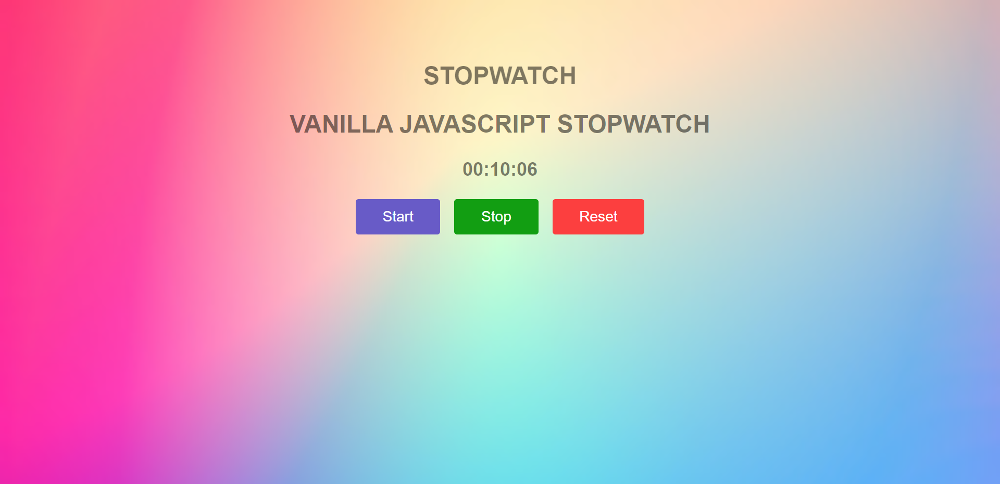

# Stopwatch



The Stylish Stopwatch with JavaScript Magic is an enchanting timekeeping marvel that combines sleek design with the wizardry of JavaScript to create a stopwatch experience like no other. With its captivating visual styles and impressive functionality, this stopwatch takes time measurement to a whole new level of elegance and excitement.

# Key Features

* **Mesmerizing Visuals**: Prepare to be dazzled by the stunning visual styles of this stopwatch. From smooth animations to vibrant colors, every detail is meticulously designed to provide a visually appealing and delightful timekeeping experience.

* **JavaScript Magic**: Powered by the wizardry of JavaScript, this stopwatch delivers seamless time tracking with utmost precision. The magic of JavaScript ensures that every second, millisecond, and fractional time is captured accurately.

* **Start, Stop, and Reset**: The stopwatch's user-friendly interface allows for effortless control with distinct buttons for starting, stopping, and resetting the time. Experience smooth transitions between actions as you take charge of your time.

* **Lap Time Tracking**: Harness the power of this stopwatch to record lap times effortlessly. Track your progress during sports activities, workouts, or any event that requires multiple time segments.

# How to Use

1. **Start the Stopwatch**: With a simple click or tap, start the stopwatch, and watch it come to life with its captivating animations.

2. **Track Lap Times**: If lap time tracking is desired, use the dedicated button to record intermediate time intervals while the stopwatch continues to run.

3. **Pause and Resume**: Control time effortlessly by pausing and resuming the stopwatch at any point. Witness the fluid transitions as the stopwatch obeys your commands.

4. **Stop and Reset**: When your timing is complete, use the "Stop" button to capture the final elapsed time. Reset the stopwatch for a fresh timing session with a single tap.

5. **Utilize Countdown Timer**: For added functionality, utilize the countdown timer feature to set specific time limits and be alerted when time runs out.

6. **Explore Themes**: Unleash the power of customization by selecting different themes and color schemes to tailor the stopwatch to your taste.

```bash
 git clone https://github.com/your-username/Stopwatch.git
```

```bash
cd Stopwatch
```

